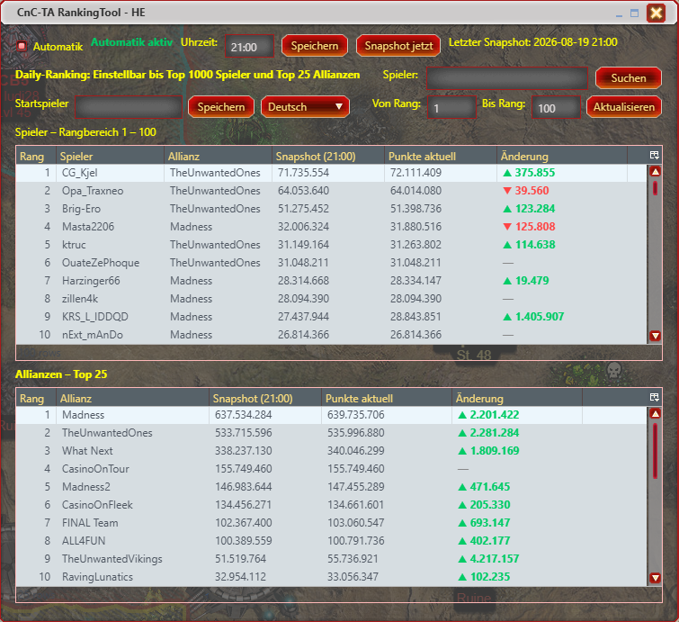
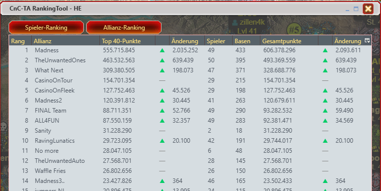
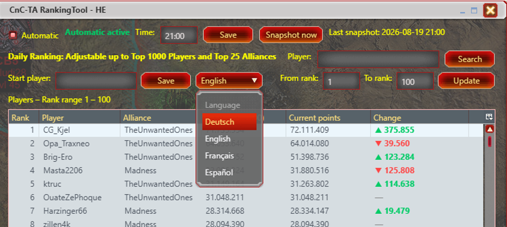

# CnC-TA RankingTool – Harzi Edition

Ein Tampermonkey-Script für **Command & Conquer: Tiberium Alliances**.

Das RankingTool erweitert das Spiel um eine übersichtliche Darstellung des Spieler- und Allianz-Rankings.

## ✨ Funktionen

### 👤 Spieler-Ranking

- Anzeige des Spieler-Rankings
- Frei einstellbarer Rangbereich
- Rangbereich bis maximal **1000**
- Einstellung bleibt nach einem Neustart gespeichert
- Aktualisierung des Rankings über den **Speichern**-Button
- Anzeige der Spielerpunkte
- Anzeige der Punktentwicklung
- Farbliche Kennzeichnung der Punktetendenz
- Spielersuche innerhalb des aktuell eingestellten Rangbereichs
- Automatisches Springen zum gefundenen Spieler

### 🏰 Allianz-Ranking

- Anzeige des Allianz-Rankings
- Anzeige der Punkte der besten 40 Spieler einer Allianz
- Anzeige der Gesamtpunkte der Allianz
- Anzeige der Punktentwicklung
- Farbliche Kennzeichnung der Punktetendenz

### 🏰 Daily-Ranking

- Anzeige des Allianz-Rankings nach automatisch oder manuell ausgelösten Snapshots
- Anzeige des Spieler-Rankings nach automatisch oder manuell ausgelösten Snapshots
- Einstellbare Snapshot Zeiten (werden automatisch erstellt wenn man im Spiel ist)
- Manuelle Snapshot Auslösung
- Automatische Snapshot Auslösung
- Anzeige der Punktentwicklung seit Snapchat
- Farbliche Kennzeichnung der Punktetendenz

### ⚙️ Weitere Funktionen

- Eigenes RankingTool-Symbol im Tampermonkey-Menü
- Integration in das C&C-TA-Scripte-Menü
- Einstellungen werden automatisch gespeichert
- Übersichtliche Darstellung innerhalb des Spiels

## 📥 Installation

Voraussetzung:

- **Tampermonkey**
- **infernal wrapper**

[**infernal wrapper installieren**](https://raw.githubusercontent.com/Harzi66/CnC-TA-Harzi-Edition/blob/main/Weitere%20C%26C%20TA%20Scripts/infernal%20wrapper.user.js)

### Direkte Installation

[**CnC-TA RankingTool – HE installieren**](https://raw.githubusercontent.com/Harzi66/CnC-TA-RankingTool-HE/main/CnC-TA-RankingTool-HE.user.js)

Alternativ kann die Datei

`CnC-TA-RankingTool-HE.user.js`

direkt aus diesem Repository heruntergeladen und in Tampermonkey installiert werden.

## Vorschau

## 📌 Version

**Version 1.5.14**

## 👨‍💻 Autor

**Harzi**

## ⚠️ Hinweis

Dieses Script ist ein privates Fan-Projekt für **C&C: Tiberium Alliances**.

Es steht in keiner Verbindung zu Electronic Arts oder anderen Rechteinhabern des Spiels.
